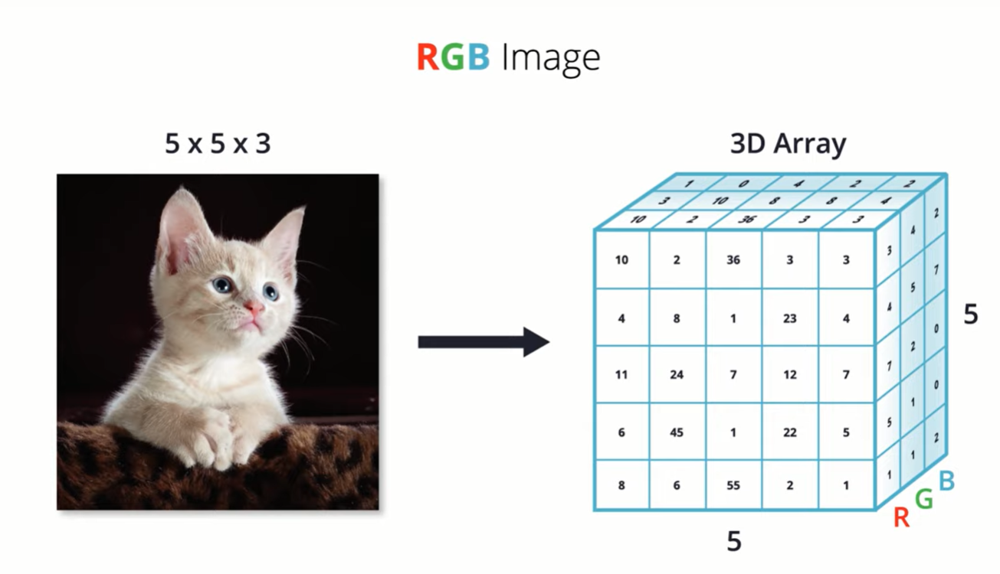
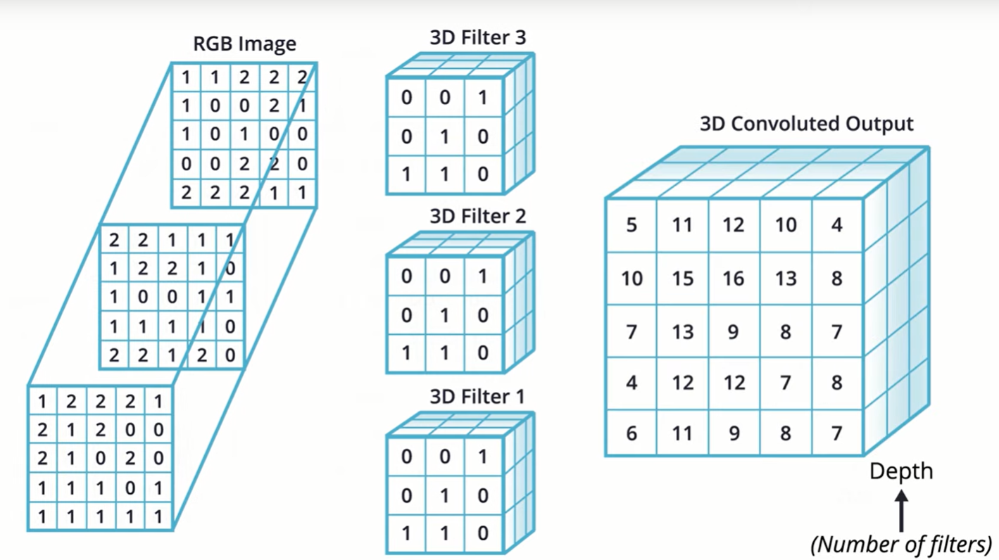
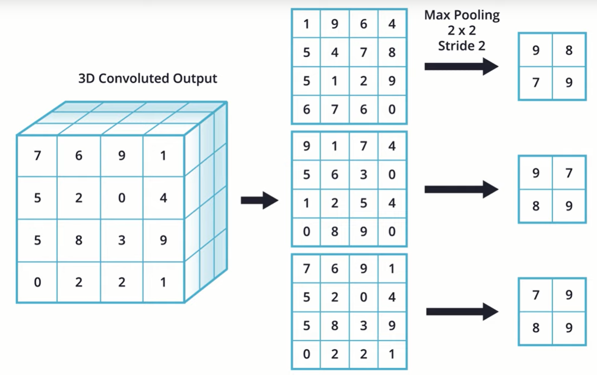
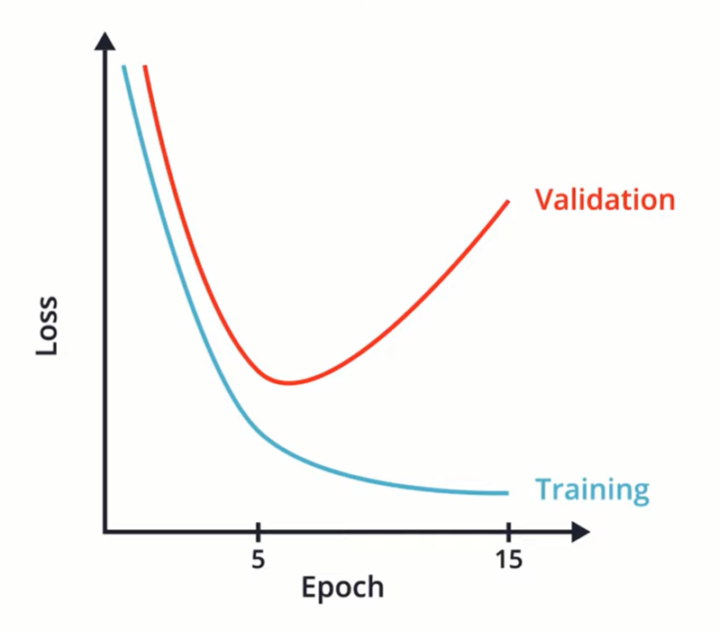
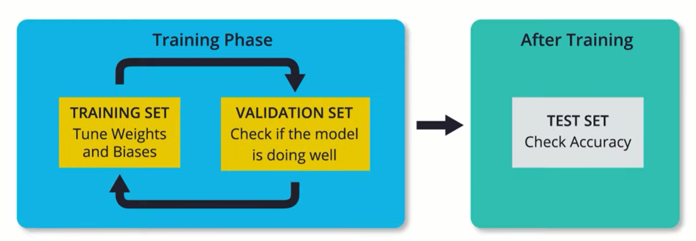
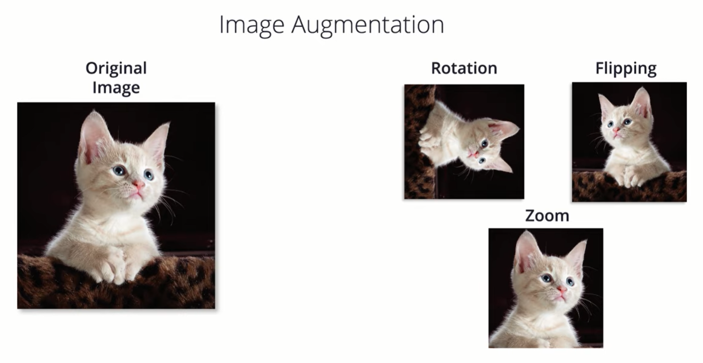
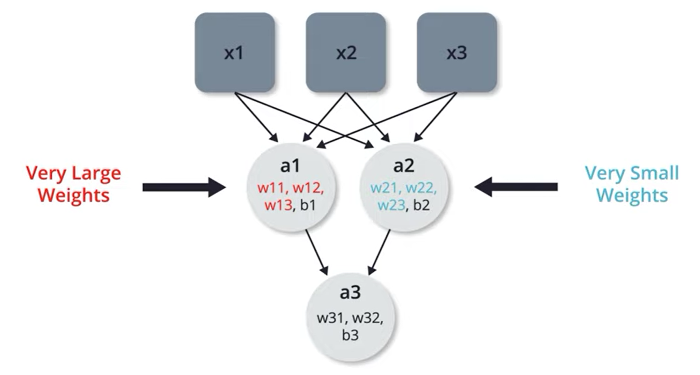
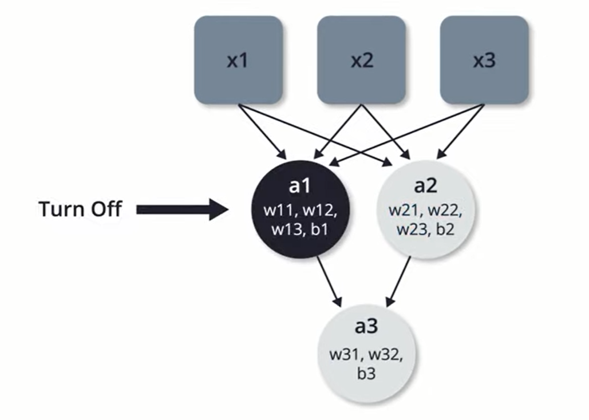

# machine_learning_04

Udacity course: https://classroom.udacity.com/courses/ud187

## Lesson 5: Going Further With CNNs

### Overfitting
Overfitting can be a common problem with CNNs.

* Caused by the **bias-variance tradeoff**.
* The *bias error* is an error from false assumptions, often caused by not having enough weights.
* The *variance error* is an error from too much sensitivity to small fluctuations (variances) in the training set. 

Possible solutions:
* Holdout sets: Check your performance on the test datasets.  As soon as error starts to *increase* again, you know you're overfitting, so you stop training.
* Constrain your network: Put biases on specific weights.  The more you constrain your weights, the less chance of overfitting.
* Training / validation / test datasets: **Only** use the test dataset for testing your results.

### Working with high-res color images of different sizes
Going to work with Microsoft Asirra dataset, which contains pictures of cats and dogs.

#### Working with images of different sizes
CNNs *must* operate on inputs of the same size.  For this reason, the images of different sizes must be resizde to the same 2D size prior to flattening.

#### Working with color images
This works the same as 2D grayscale images that have a width and height, but now there is also a "depth".  The depth is determined by the number of color channels.  So this will typically be the three color channels -- Red, Green, and Blue:



#### CNNs with color images
Much like with 2D images, 3D RGB images also utilize convolutional layers and max pooling layers.

#### Convolutional layers for color images
The `input_shape` is now 3D.  Similarly, the kernel is also now 3D.  In fact, it's customary to use multiple 3D kernels when dealing with a color image:



With the `keras` API, we still use the Conv2D interface, but our parameters change slightly. In 2D we had:

```
# Fashion MNIST
model = Sequentional()
model.add(Conv2D(32, 3, padding='same', activation='relu', input_shape=(28,28,1)))
```

In 3D, we now have:
```
# Dogs and Cats
model = Sequentional()
model.add(Conv2D(3, (3,3), padding='same', activation='relu', input_shape=(28,28,3)))
```
**Note**: The `filters` parameter is now only `3`.  And the `kernel_size` parameter is `(3,3)`.  This gives us the three 3D kernels that we desire.

#### Max pooling layers for color images
Just like with a grayscale image, we also have a sliding window with a stride length between them.  In this example, we use a 2x2 sliding window with a stride length of 2:



The end result is an image that has a width and height that are half the size, but with the same depth (number of color layers).

#### Colab Example
The Colab example is [Dogs vs Cats Image Classification without Image Augmentation](https://colab.research.google.com/github/tensorflow/examples/blob/master/courses/udacity_intro_to_tensorflow_for_deep_learning/l05c01_dogs_vs_cats_without_augmentation.ipynb).

#### Using Sigmoid instead of Softmax for Classification
We've been doing our final classification step using a Softmax layer:
```
     tf.keras.layers.Dense(2, activation='softmax')
```

It's also possible to instead use a **sigmoid** activation layer for classification:
```
     tf.keras.layers.Dense(1, activation='sigmoid')
```

If we change to a sigmoid activation function for our classifier, we also must change the `loss` parameter in the model.compile() method from `sparse_categorical_crossentropy` to `binary_crossentropy`, as shown below:

```
model.compile(optimizer='adam', 
              loss='binary_crossentropy',
              metrics=['accuracy'])
```

#### Using Training / Validation / Test to Avoid Overfitting
Note that in our Colab example, we saw that we were *overtraining* our model.  This caused the model to have extremely high accuracy for the training set, but lower accuracy for the training data set.  This is known as *overfitting*.



Essentially, the model is memorizing the training dataset, rather than producing a model of input to output.  As mentioned earlier, we can prevent this situation by breaking out data into three different datasets: training, validation, and test.



This prevents the model from becoming tuned for *both* the training dataset *and* the validation dataset.

#### Using Image Augmentation
Often times we won't have a large training dataset.  In such situations, one possible solution is to perform image augmentations to increase the dataset size and improve model accuracy:



#### Using Dropout to Improve Accuracy
It's also fairly common for select neurons to develop very heavy influence upon the model, because they have much higher weights:



One way to intentionally train the under-utilized neurons is to occasionally turn off certain neurons.  This is known as *dropout*:



#### Revisiting the Colab
Now that we know about image augmentation and dropout, we revisit the Colab [Dogs vs Cats Image Classification without Image Augmentation](https://colab.research.google.com/github/tensorflow/examples/blob/master/courses/udacity_intro_to_tensorflow_for_deep_learning/l05c02_dogs_vs_cats_with_augmentation.ipynb)

Especially noteworthy details:
1. Image augmentation is handled by adding parameters to our `ImageDataGenerator` object.  For example:
    ```
    from tensorflow.keras.preprocessing.image import ImageDataGenerator
    image_gen = ImageDataGenerator(rescale=1./255, horizontal_flip=True)
    ...
    image_gen = ImageDataGenerator(rescale=1./255, rotation_range=45)
    ...
    image_gen = ImageDataGenerator(rescale=1./255, zoom_range=0.5)
    ...
    image_gen = ImageDataGenerator(
      rescale=1./255,
      rotation_range=40,
      width_shift_range=0.2,
      height_shift_range=0.2,
      shear_range=0.2,
      zoom_range=0.2,
      horizontal_flip=True,
      fill_mode='nearest')
    ```

    Note that image augmentation is only performed to the *training* data, not the *validation* data.  This is because the original images are likely representative of the sort data that the model will need to manage.
    
2. Dropout is handled with a `Dropout` layer in our `keras` model:
    ```
    model = tf.keras.models.Sequential([
      tf.keras.layers.Conv2D(32, (3,3), activation='relu', input_shape=(150, 150, 3)),
      tf.keras.layers.MaxPooling2D(2, 2),

      tf.keras.layers.Conv2D(64, (3,3), activation='relu'),
      tf.keras.layers.MaxPooling2D(2,2),

      tf.keras.layers.Conv2D(128, (3,3), activation='relu'),
      tf.keras.layers.MaxPooling2D(2,2),

      tf.keras.layers.Conv2D(128, (3,3), activation='relu'),
      tf.keras.layers.MaxPooling2D(2,2),

      tf.keras.layers.Dropout(0.5),
      tf.keras.layers.Flatten(),
      tf.keras.layers.Dense(512, activation='relu'),
      tf.keras.layers.Dense(2)
    ])
    ```
    In this example, the dropout probability of 0.5. This means that 50% of the values coming into the Dropout layer will be set to zero. This helps to prevent overfitting.

### Next steps

## Sample Code

### System Requirements

* Python 3.7
* Pip 20.1+
* Poetry 1.1.4+:
  * `pip install poetry`
* (*On Windows 7 or later*) [Microsoft Visual C++ Redistributable for Visual Studio 2015, 2017 and 2019](https://support.microsoft.com/help/2977003/the-latest-supported-visual-c-downloads)
  * Required by tensorflow.  [Details](https://www.tensorflow.org/install/pip#system-requirements).

### Project Setup
To setup the virtual environment, run:
  > `poetry install`

To execute the Colab example *without* image augmentation and dropout, run:
  > `poetry run without`

To execute the Colab example *with* image augmentation and dropout, run:
  > `poetry run with`
